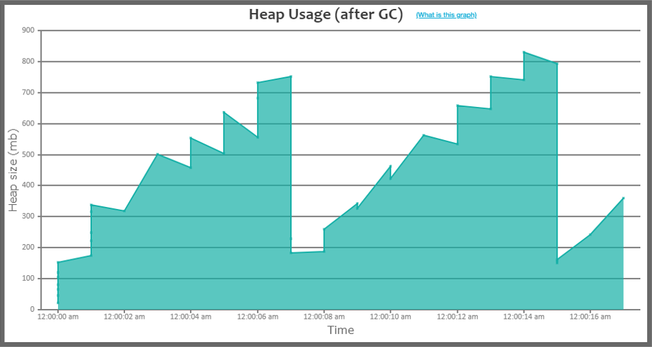
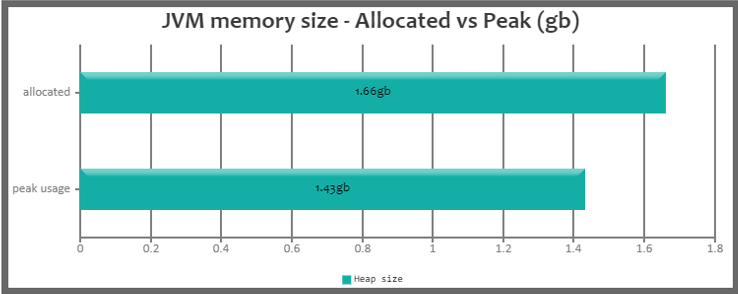
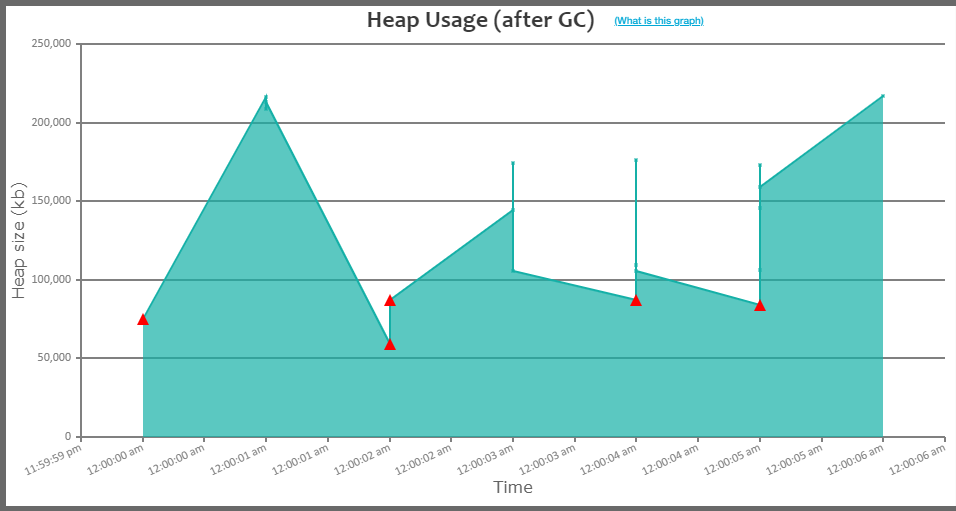

# Задание

---

Определение нужного размера хипа

**Цель**: на примере простого приложения понять какое влияние оказывают сборщики мусора

Есть готовое приложение (модуль `homework`)
Запустите его с размером хипа **256 Мб** и посмотрите в логе время выполнения.

Пример вывода:
`spend msec:18284, sec:18`

Увеличьте размер хипа до **2Гб**, замерьте время выполнения.
Результаты запусков записывайте в таблицу.
Определите оптимальный размер хипа, т.е. размер, превышение которого,
не приводит к сокращению времени выполнения приложения.

Оптимизируйте работу приложения.
Т.е. не меняя логики работы, сделайте так, чтобы приложение работало быстро с минимальным хипом.
Повторите измерения времени выполнения программы для тех же значений размера хипа.

### Характеристики операционной системы

| Name | Value |
| --------- | -------|
| Processor | Intel(R) Core(TM) i5-7200 CPU @ 2.50GHz 2.70GHz |
| Total RAM | 16 GB |

### Параметры Garbage Collector

Используемый сборщик **G1**. Во время тестов использовались только параметры изменяющие размер Heap: `-Xms` `-Xmx` 

### Тест до оптимизации

---

Тестируемый код находится в пакете: `otus.java.lupolov.before` \
Тестовые результаты в ресурсах: `/src/main/resources/before`

| Heap Size | Duration |
| :--- | :--- |
| 256 MB | OutOfMemoryError |
| 300 MB | 25 sec 360 ms |
| 512 MB | 22 sec 49 ms |
| 768 MB | 18 sec 820 ms |
| 1024 MB | 19 sec 411 ms |
| 1530 MB | 17 sec 448 ms |
| 1700 MB | 13 sec 642 ms |
| 2048 MB | 16 sec 736 ms |

#### 256 MB

При данном размере кучи приложение не работоспособно. Память потребляется быстрее чем GC может ее очищать.

#### 300 MB

Приложение смогло запустится и отработать. Но на представленной ниже диаграмме четко видно, что приложение работало на пределе своих возможностей.

На графике работы GC видно как часто приходилось осуществлять сборки. Красными треугольниками отмечены вызовы Full GC. 

Пропускная способность приложения при данном размере кучи оставляет желать лучшего, что хорошо видно из таблицы где отображена полная статистика работы GC.

#### 512 MB

Увеличение размера кучи почти в два раза, также не особо помогло приложению, оно по прежнему много времени уделяет сборке мусора.

#### 768 MB

Постепенное увеличение размера кучи, уменьшает количество сборок, что повышает пропускную способность приложения.

#### 1024 MB

#### 1530 MB

#### 1700 MB

Очень интересный случай получился при данном размере кучи, приложение отработало за минимальное время и осуществляло только сборки молодого поколения.

#### 2048 MB

Дальнейшее увеличение кучи не ускорило работу программы, а даже на оборот, количество сборок выросло, а также были задействованы другие фазы сборки, что также отразилось не в пользу пропускной способности.

### Тест после оптимизации

---

Тестируемый код находится в пакете: `otus.java.lupolov.after` \
Тестовые результаты в ресурсах: `/src/main/resources/after`

| Heap Size | Duration |
| :--- | :--- |
| 256 MB | 6 sec 423 ms |
| 512 MB | 4 sec 660 ms |
| 1024 MB | 4 sec 526 ms |

#### 256 MB

Простейшая оптимизация позволила запускать программу на минимально требуемом размере кучи. \
При этом приложение работает в два раза быстрее, потребляя в 7 раз меньше памяти чем лучший вариант до оптимизации.

#### 512 MB

Дальнейшее увеличение размера кучи не дало ощутимого прироста в скорости работы приложения.

#### 1024 MB

### Выводы

---

Основным задачей было добиться минимального времени выполнения программы через изменения параметров GC, что и было достигнуто в ходе двух экспериментов.

В первом случае тестировалось приложение без оптимизации и подбирались такие параметры GC, которые обеспечили минимальное время выполнения. \
Основным изменяемым параметром был размер кучи, изменения других параметров таких так `-XX:MaxGCPauseMillis` `-XX:InitiatingHeapOccupancyPercent` \
не привело к ускорению работы программы или увеличению пропускной способности. В текущих обстоятельствах решающим фактором был размер кучи, так как \
приложение создавало достаточно много мусора, что заставляло GC активно работать. При малом размере кучи GC очень часто собирает мусор \
что влияет на скорость работы приложения, т.е. большую часть времени выполнения программы осуществляется сборка мусора.

Во втором случае тестировалось оптимизированное приложение. Тесты показали что даже простая оптимизация существенно сокращает время работы программы \
и увеличивает пропускную способность. Помимо ускорения работы, приложение потребляет существенно меньше памяти чем до оптимизации.

Выводы из исследования я могу сделать следующие. Прежде чем прибегать к тюнингу GC следует проверить все ли хорошо написано в вашей программе, т.е. \
тюнинг должен быть последним этапом оптимизации работы приложения. Также вероятно к тюнингу следует прибегать в каких-либо специфических ситуациях \
где работа осуществляется в строго ограниченных условиях.

